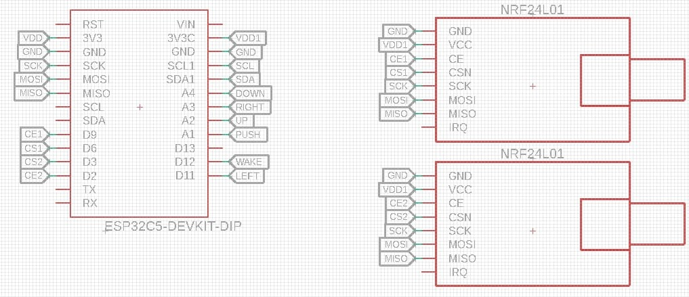

A simple 2,4 Ghz jammer using two NRF24
Tested on DFRobot FireBeetle ESP32C5 
This code is designed for ESP32C5, but will work with other ESP32 as long it has enough free GPIO pins and you have knowledge to assign the pins

# Schematic

